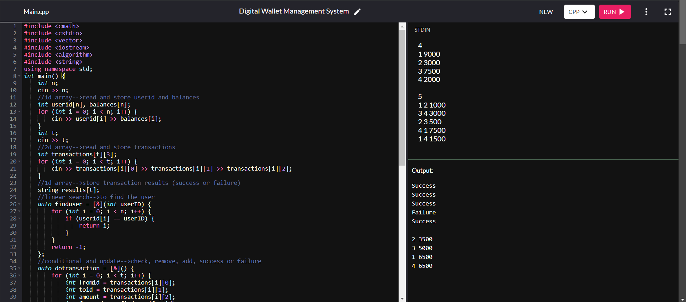

---

# Digital Wallet Management System


## Project Description

The Digital Wallet Management System is a command-line application designed to manage financial transactions between users. This system allows users to perform transactions, check for success or failure, and sort users based on their remaining balances. The project was developed as part of "Module-1" of training given by f(Y)_Solutions.

## Features

- **User Management**: Read and store user IDs and their balances.
- **Transaction Processing**: Handle transactions between users and update their balances accordingly.
- **Sorting**: Sort users based on their remaining balances after transactions.
- **Transaction Status**: Display the result of each transaction as either "Success" or "Failure".

## Table of Contents

- [Prerequisites](#prerequisites)
- [How to Install and Run the Project](#how-to-install-and-run-the-project)
- [How to Use the Project](#how-to-use-the-project)
- [Include Tests](#include-tests)
- [Screenshots/Media](#screenshotsmedia)
- [Future](#future)
- [How to Contribute to the Project](#how-to-contribute-to-the-project)
- [License](#license)
- [Credits](#credits)
- [Author](#author)
- [Conclusion](#conclusion)
- [Connect with Me](#connect-with-me)

## Prerequisites

- A C++ compiler (e.g., GCC, Clang)
- Basic understanding of C++ programming

## How to Install and Run the Project

1. **Clone the Repository**:
   ```bash
   git clone https://github.com/DarshanKagi/DigitalWalletManagementSystem.git
   ```
2. **Navigate to the Project Directory**:
   ```bash
   cd DigitalWalletManagementSystem
   ```
3. **Compile the Code**:
   ```bash
   g++ -o DigitalWalletManagementSystem DigitalWalletManagementSystem.cpp
   ```
4. **Run the Executable**:
   ```bash
   ./DigitalWalletManagementSystem
   ```

## How to Use the Project

1. **Input Data**:
   - Provide the number of users followed by their IDs and balances.
   - Input the number of transactions followed by details of each transaction (fromID, toID, amount).

2. **View Results**:
   - The system will output the result of each transaction (Success/Failure).
   - The final sorted list of users with their balances will be displayed.

## Include Tests

The project currently does not include automated tests. To test the system, you can manually input data as described in the [How to Use the Project](#how-to-use-the-project) section.

## Screenshots/Media

Below is a screenshot of the Digital Wallet Management System in action, showing the input data, output results, and final sorted user balances:

](https://github.com/DarshanKagi/Digital-Wallet-Management-System/blob/6fc023f1c2e5b1279b652cae672e118d30c63232/Result%20Picture.png)

## Future

- Implement a graphical user interface (GUI) for easier interaction.
- Add functionality for user account creation and management.
- Enhance error handling and validation of inputs.

## How to Contribute to the Project

1. **Fork the Repository**: Create a personal fork of the repository.
2. **Create a New Branch**: 
   ```bash
   git checkout -b feature/new-feature
   ```
3. **Make Changes**: Implement your changes or new features.
4. **Submit a Pull Request**: Push your changes to your fork and create a pull request.

## License

This project is licensed under the MIT License. See the [LICENSE](LICENSE) file for details.

## Credits

- **f(Y)_Solutions**: For providing the training module.
- **Contributors**: 
  - [Darshan S Kagi](https://github.com/DarshanKagi)

## Author

Darshan S Kagi - [darshankagi04@gmail.com](mailto:darshankagi04@gmail.com)

## Conclusion

Thank you for checking out the Digital Wallet Management System. Feel free to contribute and provide feedback!

## Connect with Me

- [LinkedIn](https://www.linkedin.com/in/darshan-kagi-938836255)
- [GitHub](https://github.com/DarshanKagi)

---
